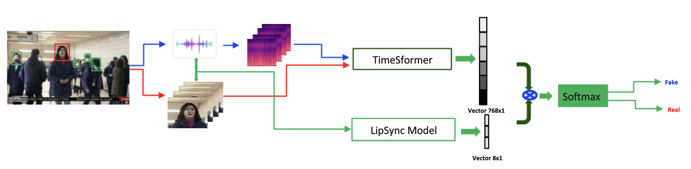

# Multimodal Model for Deepfake Detection

This repository contains our implementation of Multimodal Model for deepfake detection submitted for the [AI Singapore Trusted Media Challenge](https://github.com/AISG-Technology-Team/Trusted-Media-Challenge-Submission-Guide). Our approach leverages both visual (face frames) and audio (mel spectrogram) features, along with a SyncNet-based latency estimation model, to improve the detection of fake audiovisual content.

## Overview

### Pipeline of the Architecture

The architecture of the model is illustrated in the following diagram:



In this pipeline:
- Faces are detected and cropped from video frames using RetinaFace.
- Audio is extracted from the video and transformed into a mel spectrogram.
- The cropped face frames are passed to a TimeSformer model to extract spatio-temporal features (vector of size 768).
- The mel spectrogram is processed by the SyncNet model to calculate audio-visual latency features (vector of size 8).
- These feature vectors are concatenated and fed into a fully connected layer for classification.
- The final output predicts whether the video is "real" or "fake."

With the rapid advancement of deep learning, generating fake media (e.g., face-swapped videos with manipulated audio) has become easier, causing concerns about misinformation and trust in digital media. The Trusted Media Challenge is an initiative aimed at encouraging the development of AI solutions to detect such fake audiovisual content reliably.

### Goals:

- Detect whether a given video is genuine or fake.
- Achieve a high ROC AUC score, the primary evaluation metric.
- Optimize execution time as a secondary ranking criterion when AUC scores are tied.

## Key Features

- **Multimodal Input:** The model processes both video frames and corresponding audio mel spectrograms.
- **Facial Region Extraction:** Uses RetinaFace for face detection and cropping, focusing on the facial region for more reliable feature extraction.
- **SyncNet Latency Features:** Incorporates SyncNet-based latency calculations to measure audio-visual synchronization, enhancing the model’s ability to detect subtle lip-sync mismatches.
- **TimeSformer Backbone:** Utilizes a TimeSformer model from the `mmaction2` framework to encode spatio-temporal features from the video frames.

## Project Structure

```plaintext
.
├─ Dockerfile                    # Sample Dockerfile for environment setup
├─ config.json                   # Configuration file (paths, hyperparameters)
├─ requirements.txt              # Python dependencies
├─ data_loader.py                # Lightning DataModule for train/val/test splits
├─ dataset.py                    # PyTorch Dataset definition for loading samples
├─ model.py                      # Model definition (TimeSformer + latency network + classifier)
├─ SyncNetModel.py               # SyncNet model architecture for A/V alignment features
├─ utils.py                      # Utility functions (augmentations, logging, transforms)
├─ train.py                      # Training script using PyTorch Lightning
├─ eval.py                       # Evaluation and inference script
├─ crop.py                       # Preprocessing script for face extraction & feature creation
├─ retinaface/                   # RetinaFace library folder for face detection
├─ syncnet_v2.model              # SyncNet pretrained weights
├─ model.ckpt                    # Model checkpoint (trained weights)
└─ README.md                     # Documentation (this file)
```

### Key Directories and Files:

- **`retinaface`**: Contains the RetinaFace implementation for face detection.
- **`crop.py`**: Processes input videos to:
  - Detect faces.
  - Extract face regions and synchronize with audio.
  - Produce `.npz` files with preprocessed data (face frames and mel spectrograms).
- **Data Files**: The dataset (not included in this repository) should contain `.mp4` videos and accompanying CSV files indicating the split and labels.

### Processed Dataset Structure:

The `crop.py` script processes the input videos into a structured dataset with both face crops and mel-spectrogram features, stored in `.npz` files. Each `.npz` file contains:

- **`faces`**: Cropped face frames extracted from the video.
- **`mel_3cs`**: Mel-spectrogram images generated from the video’s audio.
- **`mdist`, `latency`, and `conf`**: Latency metrics computed by the SyncNet model for audio-visual alignment.

Example structure of the `root_path` after preprocessing:

```plaintext
root_path/
├─ data/
│  ├─ train_dev_test.csv       # File CSV containing filename, filepath, split, and label
│  ├─ train/                   # Preprocessed training data
│  │  ├─ video1.npz            # Processed file with face and mel-spectrogram data
│  │  ├─ video2.npz
│  ├─ val/                     # Preprocessed validation data
│  │  ├─ video3.npz
│  │  ├─ video4.npz
│  ├─ test/                    # Preprocessed test data
│  │  ├─ video5.npz
│  │  ├─ video6.npz
```

The `train_dev_test.csv` file should include the following columns:
- `filename`: Name of the video file.
- `filepath`: Path to the corresponding `.npz` file.
- `split`: Split type (`train`, `val`, `test`).
- `label`: Ground truth label (e.g., `0` for real, `1` for fake).

## Dependencies

Install Python dependencies using `requirements.txt`:

```bash
pip install -r requirements.txt
```

### Notable dependencies:
- PyTorch & PyTorch Lightning
- mmaction2 for TimeSformer
- Albumentations for image augmentation
- MoviePy for video/audio processing
- Librosa for audio feature extraction
- RetinaFace for face detection

## Configuration

Edit `config.json` to adjust paths, hyperparameters, and other settings. For example:

```json
{
    "max_clip_len": 16,
    "face_detection_step": 64,
    "frame_num": 16,
    "frame_size": 224,
    "freq_num": 128,
    "resample_rate": 16000,
    "lr": 5e-3,
    "seed": 100,
    "device": "cuda",
    "train_batch_size": 2,
    "submit_batch_size": 1,
    "root_path": "/path/to/processed_data/",
    "epoch": 32
}
```

## Training

### 1. Preprocessing:

Run `crop.py` on your training dataset to extract face crops and mel spectrogram features:

```bash
python crop.py --workers 4 --input /path/to/input_videos --output /path/to/metadata --save-image --save-avi
```

This produces `.npz` files in the `metadata` directory. Repeat this process for the `train`, `val`, and `test` splits to preprocess the entire dataset.

### 2. Training the Model:

Assuming you have a CSV file `train_dev_test.csv` in `root_path/data/` that contains `filename`, `filepath`, `label`, and `split` columns:

```bash
python train.py --data-version train_dev_test --code-version v1 --pret-version pretrain_1
```

This will:
- Load the dataset splits from `root_path/data/train_dev_test.csv`.
- Use the model architecture in `model.py`.
- Train and evaluate using PyTorch Lightning.
- Log metrics to Weights & Biases if configured.
- Save the best model checkpoint based on validation AUC.

### Primary Metric: ROC AUC

The model is optimized for Area Under the ROC Curve (AUC). A perfect classifier has an AUC of 1.0, while a random classifier has an AUC of 0.5.

## Evaluation

Once training is complete, evaluate the model on a test set:

```bash
python eval.py -input /path/to/test_videos -output submission.csv
```

This script will:
- Crop faces and extract features from test videos.
- Load the saved model checkpoint.
- Run inference on the test set.
- Compute AUC if ground-truth labels are available.
- Save the final predictions (filename and predicted probability) in `submission.csv`.

## AUC Metric

The primary metric for this challenge is the ROC AUC. A perfect classifier has an AUC of 1.0, while a random classifier has an AUC of 0.5. The higher the AUC score, the better the model performance and ranking.

Our model achieved a ROC AUC score of **96.63%** on a test set of 1,500 videos provided by the organizers.

### Ranking and Tie-break

If two submissions have the same AUC, the one with the lower inference time will be ranked higher. Thus, performance optimization is also encouraged.


## Additional Notes

- The dataset (~8000 labeled videos) is provided by the Trusted Media Challenge organizers. Ensure that you follow the dataset terms of use.
- Please refer to the official [Trusted Media Challenge Submission Guide](https://github.com/AISG-Technology-Team/Trusted-Media-Challenge-Submission-Guide) for more details on the competition rules, evaluation process, and submission requirements.

---